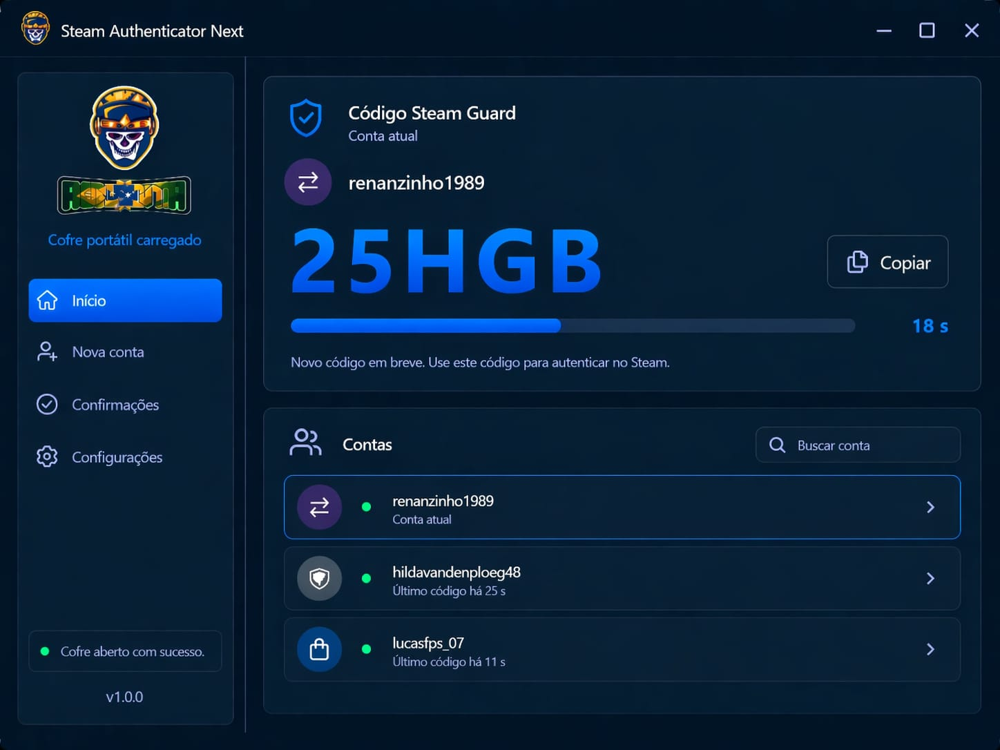
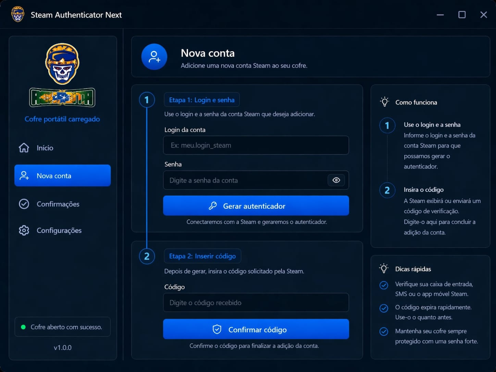
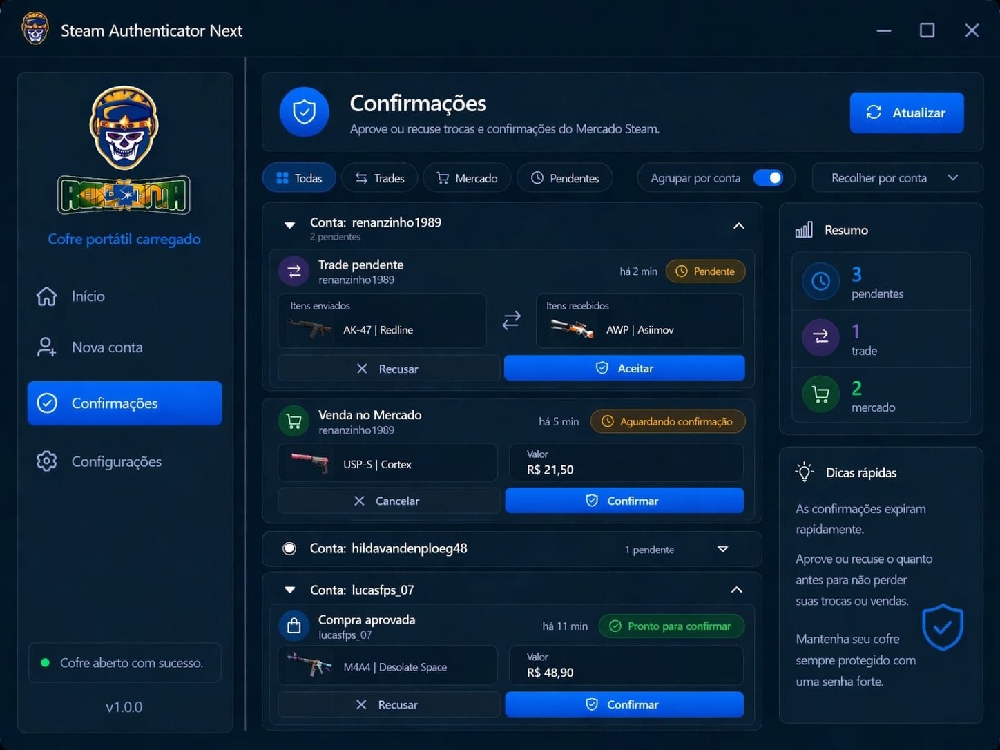
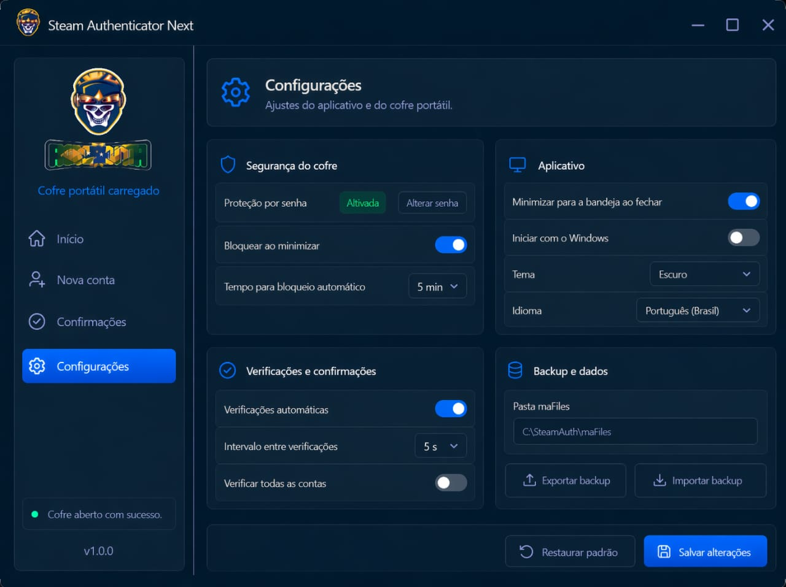

# Steam Desktop Authenticator Next

Desktop app for Steam Guard codes and Steam confirmations (including trade confirmations), focused on local data storage.

## Screenshots

### Dashboard (Steam Guard code)


### New account flow


### Confirmations (trade/market)


### Settings and vault protection


## PT-BR

### O que este app faz
- Gerencia contas Steam com autenticacao em 2 fatores.
- Gera codigos Steam Guard em tempo real.
- Permite aprovar/recusar confirmacoes da Steam.
- Mantem os arquivos de cofre local (`maFile`) no computador do usuario.

### Aviso legal e responsabilidade
- Uso por sua conta e risco.
- O software e fornecido "como esta", sem garantias.
- O usuario e responsavel pela protecao do PC, backup e seguranca dos arquivos locais.

### Privacidade e seguranca
- Dados salvos localmente no computador do usuario.
- Este projeto nao usa backend proprio em nuvem para armazenar contas.
- O app apenas se comunica com os servicos oficiais da Steam para autenticacao e confirmacoes.
- Recomendado: ative **Protecao por senha** em **Configuracoes > Seguranca do cofre** para proteger os dados locais.

### Recomendacao para GitHub
- Mantenha o repositorio **privado** para proteger o codigo-fonte.
- Distribua apenas o binario compilado (`.zip`) para usuarios finais.
- Nunca publique `maFiles`, `manifest.json`, arquivos de configuracao local ou credenciais.

### Requisitos
- Windows x64
- .NET SDK 9.0 (para build local)
- DLLs de dependencia em `../recovered-bundle/`:
  - `SteamAuth.dll`
  - `SteamKit2.dll`
  - `Newtonsoft.Json.dll`

### Build local (desenvolvimento)
```powershell
dotnet restore "Steam Authenticator Next.csproj"
dotnet build "Steam Authenticator Next.csproj" -c Release
```

### Publish para distribuicao
```powershell
dotnet publish "Steam Authenticator Next.csproj" -c Release -r win-x64 --self-contained true /p:PublishSingleFile=true
```

O executavel final ficara em:
`bin\Release\net9.0-windows\win-x64\publish\`

---

## EN

### What this app does
- Manages Steam accounts with 2FA.
- Generates real-time Steam Guard codes.
- Allows approving/denying Steam confirmations.
- Keeps local vault files (`maFile`) on the user's machine.

### Legal and responsibility notice
- Use at your own risk.
- The software is provided "as is", without warranties.
- Users are responsible for PC security, backups, and local file protection.

### Privacy and security
- Data is stored locally on the user's computer.
- This project does not use its own cloud backend for account storage.
- The app only connects to official Steam services for authentication and confirmations.
- Recommended: enable **Password protection** in **Settings > Vault security** to better protect local data.

### GitHub recommendation
- Keep the repository **private** to protect the source code.
- Distribute only the compiled binary (`.zip`) to end users.
- Never publish `maFiles`, `manifest.json`, local settings files, or credentials.

### Requirements
- Windows x64
- .NET SDK 9.0 (for local builds)
- Dependency DLLs in `../recovered-bundle/`:
  - `SteamAuth.dll`
  - `SteamKit2.dll`
  - `Newtonsoft.Json.dll`

### Local build (development)
```powershell
dotnet restore "Steam Authenticator Next.csproj"
dotnet build "Steam Authenticator Next.csproj" -c Release
```

### Publish for distribution
```powershell
dotnet publish "Steam Authenticator Next.csproj" -c Release -r win-x64 --self-contained true /p:PublishSingleFile=true
```

Final executable output:
`bin\Release\net9.0-windows\win-x64\publish\`

## Documentation
- [User Guide (PT-BR)](docs/GUIA_RAPIDO_PTBR.md)
- [Quick Start (EN)](docs/QUICK_START_EN.md)

## License
Proprietary license. See [LICENSE](LICENSE).
